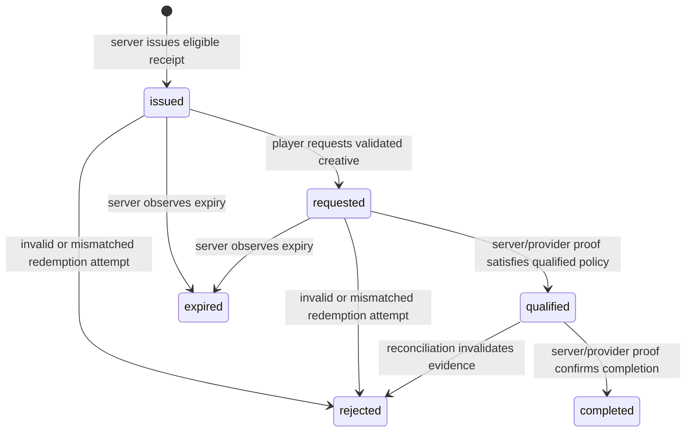

# Kryv Signed Advertising Delivery Receipt Design

**Status:** Design and pre-launch control record. Advertising delivery remains hard-disabled (`AD_DELIVERY_RUNTIME_ENABLED = false`). The production-pending receipt schema in `0023_ad_delivery_receipts.sql` has **not** been promoted to production, and this document does not enable an impression endpoint, campaign billing, revenue allocation, or client-driven frequency-cap updates.

## Purpose and Security Boundary

A future advertising decision must not be treated as proof that a creative was shown. The decision service currently evaluates policy eligibility only; a signed delivery receipt would create a short-lived, server-issued correlation handle for a *specific* eligible opportunity. It is not a payment instrument, a public bearer authorization for creative retrieval, or proof of delivery.

**Current implementation boundary:** `ad_delivery_receipts` is intentionally not mapped into the active Drizzle application schema and no receipt route exists. This prevents production code from querying a table that has not received explicit production-promotion approval. A future implementation must introduce the schema mapping, migrations, endpoint contract, and reconciliation worker as one separately reviewed launch-gated change set.

> **Core rule:** Browser events are untrusted telemetry. They may request a state transition, but they must never directly create qualified delivery, bill a campaign, credit a creator, consume a frequency cap, or alter revenue allocation.

| Objective | Required control |
| --- | --- |
| Bind an opportunity to the right viewer context | Persist the authenticated `user_id`, optional active `profile_id`, surface, ad break, creative, expiry, and canonical decision digest server-side. |
| Prevent replay | Issue an opaque, signed, short-lived receipt token; enforce one-way, atomic state transitions against one receipt row. |
| Prevent tampering | Verify a versioned HMAC signature in constant time; recompute or compare the canonical decision digest server-side. |
| Preserve privacy | Keep user, profile, consent, campaign budget, and frequency data out of browser-visible token claims. |
| Keep financial data authoritative | Only separately reviewed server/provider reconciliation can write qualified/completed impression and revenue records. |
| Fail safely | Invalid, expired, consumed, mismatched, or unavailable receipt state yields no measurement credit and no retry-amplified financial action. |

## Receipt Issuance Model

Receipt issuance is a future internal step performed **only after** the existing decision flow has passed every launch gate: runtime hard-enable removal under a separately approved change, feature flag, authenticated viewer identity, active profile-grant validation where applicable, consent, campaign approval and funding, time window, creative validation, and frequency policy.

The server should first insert an `ad_delivery_receipts` row with `delivery_status = 'issued'`. The server then returns a compact opaque receipt token alongside the otherwise eligible ad opportunity. The raw token is never stored. The database stores a deterministic `decision_hash` built from canonical decision data, and the server recomputes it whenever a receipt is redeemed.

### Opaque Signed Token, Version 1

The browser-visible token should contain no direct identity or commercial value. A compact versioned payload is sufficient:

```text
v1.<receipt-id>.<issued-at-epoch>.<expires-at-epoch>.<decision-digest>.<signature>
```

The signature is `HMAC-SHA-256` over the dot-separated fields using a dedicated `AD_RECEIPT_SIGNING_SECRET`. The signing secret must be high-entropy, server-only, rotated through a versioned key identifier plan, and required in production before receipt issuance is enabled. The token must be verified with a constant-time comparison.

| Token field | Meaning | Browser exposure policy |
| --- | --- | --- |
| `v1` | Parser and cryptographic-format version | Safe to expose. |
| `receipt-id` | UUID primary key used for row lookup | Safe only as a short-lived opaque correlation value. |
| `issued-at` / `expires-at` | Bounded validity window | Safe to expose; expiry must be short and server-enforced. |
| `decision-digest` | Digest binding the receipt to immutable decision context | Safe to expose only as an opaque value, never as raw context. |
| `signature` | Server-authenticity proof | Safe to transmit; not a credential for any other API. |

The `decision_hash` should derive from a stable canonical serialization of immutable values such as receipt UUID, ad break ID, creative ID, authenticated user ID, optional profile ID, surface, optional channel/video context, issuance time, expiry time, and decision format version. The server should use an HMAC or a hash of this canonical payload with a server-held pepper, not unstructured JSON serialization.

## Redemption and Measurement State Machine

A future browser report endpoint may accept a receipt token and a constrained event type, but it must only request a transition. The server verifies all bindings before performing a single conditional update.



| Current state | Allowed next state | Server-side prerequisites |
| --- | --- | --- |
| `issued` | `requested` | Valid signature, unexpired token, authenticated session owns receipt, active profile still matches when present, canonical digest matches. |
| `requested` | `qualified` | Independently verified delivery evidence under a separately approved policy; browser self-report alone is insufficient. |
| `qualified` | `completed` | Provider/server completion evidence and idempotency key accepted. |
| `issued` or `requested` | `expired` | Receipt expiry passed; no credit is created. |
| Any active state | `rejected` | Verification mismatch or reconciliation rejection; audit the reason without exposing sensitive detail to the browser. |

The transition query must include the receipt ID, expected current status, expiry, user ID, and profile binding in its `WHERE` clause. A zero-row update is a normal fail-closed response. The service must not retry a financial or frequency-affecting transition without a durable idempotency key.

## Required Reconciliation Separation

The existing `ad_impressions`, campaign budget, creator balance, and revenue-movement paths must remain downstream of a dedicated reconciliation service. Receipt issuance and browser requests do not update these records. A later reconciliation worker may write an impression only after validating receipt state and trusted delivery evidence; it must use unique event/provider identifiers and an atomic transaction for the final one-time accounting transition.

Before implementation, add a separate migration and review for durable delivery-event idempotency. The current receipt table has a unique decision digest, but it does not by itself identify repeated provider callbacks or event payloads. Do not overload `failure_reason` as evidence storage, and do not place raw provider payloads, IP addresses, user agents, or full browser telemetry in the receipt row.

## Endpoint and Cache Policy for a Future Launch

| Boundary | Launch-safe requirement |
| --- | --- |
| Decision | `Cache-Control: private, no-store`; dedicated shared rate limiter; authenticated identity and consent checked before expensive campaign or frequency reads. |
| Receipt issuance | Same request or server-internal call only after eligibility passes; never issue when runtime delivery is disabled. |
| Receipt report | Authenticated `POST`, trusted-origin CSRF protection, tight shared rate limit, body-size cap, receipt-specific persistent abuse limits, and no cache. |
| Creative delivery | Receipt cannot authorize arbitrary URLs; creative source and landing URL remain server-approved HTTPS values. |
| Reconciliation | Asynchronous durable worker with idempotency, audit logging, replay-safe provider verification, and a separately reviewed incident/reversal procedure. |
| Operator access | Receipt lookup and state transitions require owner-scoped audit logs; browser responses expose only a generic accepted/rejected result. |

## Launch Gates

1. The production receipt schema must be promoted only after an authorized operator explicitly approves the branch-validated migration.
2. A dedicated signing-secret configuration, rotation procedure, and production fail-closed startup check must be implemented and reviewed.
3. Receipt issuance, report handling, state transitions, reconciliation, budget handling, creator allocation, and fraud controls must be implemented as separately tested changes.
4. End-to-end tests must cover cross-user replay, cross-profile replay, expiry, duplicate report idempotency, decision-context mismatch, signature tampering, concurrent redemption, consent withdrawal, provider callback replay, and worker retry behavior.
5. Advertising delivery must remain disabled until all gates are complete and a launch owner explicitly enables it under a monitored rollout plan.

## Current Decision

Kryv should adopt a signed, short-lived, opaque receipt protocol for future ad delivery measurement. The protocol must be server-bound, privacy-minimizing, idempotent, and reconciliation-gated. No receipt API should be exposed and no delivery, accounting, or revenue split should be enabled from this design record alone.
