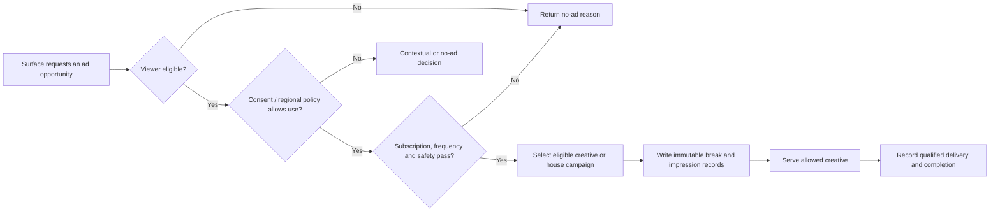

# Kryv Platform Target Architecture

**Status:** Implementation blueprint  
**Scope:** Live, Watch, Cinema, creator operations, advertising, crypto monetization readiness, and owner administration  
**Primary rule:** The working FastPix channel-provisioning, RTMPS ingest, and live HLS playback paths remain protected boundaries. Every extension composes with them rather than replacing them.

## Product operating model

Kryv is a unified entertainment platform with four deliberate operating surfaces: **Viewer**, **Creator Studio**, **Cinema**, and **Owner Control**. The consumer front door must remain premium and uncluttered while creators and operators receive task-specific tools backed by authoritative data.

| Surface | Primary user | Job to be done | Product character |
|---|---|---|---|
| **Kryv Home / Live / Watch** | Viewer | Find a worthwhile live stream, video, or community quickly | Fast, discovery-led, mobile-first |
| **Creator Studio** | Channel owner and trusted moderator | Go live safely and manage the broadcast, community, content, and measured performance | Operational, dense, real-time |
| **Cinema** | Viewer and title curator | Browse and resume lawfully available premium programming | Cinematic, profile-aware, editorial |
| **Owner Control** | Platform owner and authorized operators | Govern catalog, ads, users, creator operations, safety, and health | Deliberate, auditable, guarded |

Kryv uses proven interaction principles without cloning any competitor: profile-scoped viewing and continuation rails; live session health, configurable widgets, and visible moderation; explainable discovery rails and creator measurement; and consent-aware frequency- and pod-based advertising. [1] [2] [3] [4] [5]

## Experience and navigation architecture

### Consumer navigation

The desktop header prioritizes **Home**, **Live**, **Watch**, and **Cinema**, plus universal search, notifications, profile switching, and contextual actions. A channel owner receives one **Creator Studio** entry point; the platform owner receives one **Owner Control** entry point. Consumer navigation never exposes every internal tool.

On mobile, the primary viewer navigation is a bottom bar with **Home**, **Live**, **Watch**, **Cinema**, and **Library**. Search, account, and creator tools live in a compact top sheet or account menu. Semantic content order remains intact as grids adapt for smaller screens.

### Creator Studio navigation

Creator Studio uses a left sidebar on desktop and a compact segmented control or bottom sheet on mobile.

| Creator section | Functional scope | Source of truth |
|---|---|---|
| **Overview** | Current status, next action, preview, session metrics, recent activity | FastPix/stream API and Kryv events |
| **Stream Manager** | Preview, title/category/language, chat, activity, moderation, quick actions | Existing protected live endpoints plus role checks |
| **Stream Setup** | Endpoint, masked stream key, safe rotation, OBS guidance | Existing FastPix channel configuration |
| **Content** | Videos, VODs, clips, publish state, captions, upload readiness | Kryv video records and FastPix VOD status |
| **Analytics** | Overview, Content, Audience, Discovery; Revenue only when settled data exists | Aggregated event and payment ledger data |
| **Community** | Roles, chat rules, moderation history, points, polls, predictions, raids | Channel and moderation domain |
| **Monetization** | Tips, subscriptions, balances, payout readiness | Internal ledger and provider state |
| **Settings** | Profile, branding, alerts, safety preferences | Creator-owned data |

The overview always communicates one next action. Offline creators see **Prepare your stream** or **Go live**. Live creators see **Open Stream Manager**. It never invents viewers, health, previews, or revenue.

### Cinema navigation and content behavior

Cinema receives a premium browse shell but reuses account, profile, search, notification, playback, and entitlement primitives. The top-level view contains an editorial hero plus profile-aware **Continue Watching**, **My List**, **Recently Added**, **Because You Watched**, and editorial/genre rails. Guests receive editorial and trending rows with no silent behavioral targeting. [1]

Desktop title cards use delayed hover and keyboard focus. If a ready, authorized trailer or preview exists, the reveal starts a muted preview and shows title, year, rating, duration, genres, and actions. Without an approved preview, an information-rich artwork treatment is used. On touch, details are explicit; no essential interaction is hover-only.

### Owner Control navigation

The existing owner page is a valuable access-control base, but it is not yet an operational console: it has three tabs, a placeholder Cinema action, and a hard-coded proxy IP. Owner Control becomes a dedicated shell:

| Owner section | Responsibility | Guardrail |
|---|---|---|
| **Command Center** | Health, live channels, ingestion failures, content queue, pending payments, reports | Read-only default; drill-downs preserve audit context |
| **People & Access** | Users, bans, appeals, admin roles, creator verification, session-risk signals | Least privilege; owner protected; mutations audited |
| **Creator Operations** | Channels, live sessions, violations, escalations, strikes, stream health | Operators cannot rotate creator keys or impersonate creators |
| **Cinema Catalog** | Titles, metadata, artwork, feature/trailer assets, rights windows, ratings, scheduling | Rights information and review required before publishing |
| **Advertising** | Inventory rules, creatives, campaigns, break policy, caps, delivery reporting | No activation without consent and policy gates |
| **Commerce** | Provider state, payment events, reconciliations, payout review | Ledger-first; payout needs approval and verified provider state |
| **Trust & Safety** | Reports, blocked terms, content review, appeals, enforcement history | Human review for material enforcement |
| **Configuration** | Feature flags, notices, legal-document versioning, territory/currency policy | Secrets never appear in application tables |
| **Audit Log** | Actor, action, target, before/after, reason, request/session context, time | Append-only; restricted exports |

## Authorization and operating permissions

Kryv uses explicit RBAC with channel-scoped permissions. A frontend redirect is not authorization; each privileged API handler must call a common policy layer.

| Capability | Viewer | Channel moderator | Channel owner | Platform admin | Platform owner |
|---|---:|---:|---:|---:|---:|
| View public media | Yes | Yes | Yes | Yes | Yes |
| Send chat subject to channel rules | Yes | Yes | Yes | Yes | Yes |
| Delete chat / timeout / ban in assigned channel | No | Yes | Yes | Escalation only | Yes |
| Edit stream metadata / manage stream key | No | Limited if assigned | Yes | No | Yes |
| Publish channel VOD/clip | No | No | Yes | No | Yes |
| Create or publish Cinema titles | No | No | No | Authorized catalog role | Yes |
| Manage ads / campaigns / ad policy | No | No | No | Authorized advertising role | Yes |
| View payment ledger / approve payout | Own history | No | Own balance | Review-only where assigned | Yes |
| Grant roles / change flags / export audits | No | No | No | Narrowly assigned | Yes |

Sensitive actions must record actor, target, reason, pre-change and post-change state. Destructive operations default to archival or state transitions; permanent deletion is exceptional.

## Canonical data domains

Kryv keeps product entities separate from provider assets, provider transactions, and analytics. Existing application IDs remain numeric; provider IDs are dedicated external string fields.

| Domain | Core records | Critical fields and constraints |
|---|---|---|
| **Viewer profiles** | `viewer_profiles`, `profile_watch_history`, `profile_my_list`, `profile_preferences` | Parent user, profile name, avatar, maturity settings, PIN hash, active profile; history isolated by profile |
| **Cinema catalog** | `cinema_titles`, `cinema_title_assets`, `cinema_title_genres`, `cinema_rights_windows` | Unique slug, synopsis, year, runtime, rating, artwork, state, territory, availability, rights reference, editorial rank |
| **Cinema assets** | `cinema_title_assets` | Kind (`feature`, `trailer`, `hover_preview`, `caption`, `artwork`), FastPix IDs, status, provenance, checksum, approval timestamps |
| **Creator access** | `channel_roles`, `channel_role_audits` | Unique channel/user assignment, scoped permissions, actor, expiry, revocation reason |
| **Moderation** | Existing tables plus `channel_rules`, `moderation_cases` | Scope, reporter, subject, evidence, disposition, reviewer, timestamps |
| **Advertising** | `ad_campaigns`, `ad_creatives`, `ad_rules`, `ad_breaks`, `ad_impressions`, `ad_delivery_events` | State machine, surface, duration budget, targeting, consent need, defer window, delivery ledger |
| **Consent** | `consent_preferences`, `consent_receipts` | Purpose, region, legal text version, grant/withdraw time, source |
| **Commerce** | `payment_intents`, `payment_events`, `creator_balances`, `payout_requests`, `payout_approvals` | Unique internal/provider references, immutable events, held/pending/available balances, review trail |
| **Operations** | `audit_logs`, `feature_flags`, `system_notifications` | Actor, action, target, before/after JSON, reason, request context, expiry |

### Cinema publishing workflow

A title is a catalog record; FastPix is the media-processing and playback provider.

1. A catalog operator creates a **draft title** with editorial metadata, classification, territory, and rights-window information.
2. The operator creates an **asset upload intent**. The server authenticates the actor, validates asset role, requests a FastPix signed upload URL, and stores the pending provider media ID. No FastPix secret reaches the browser.
3. The browser uploads lawfully obtained media to the short-lived URL. Kryv processes verified FastPix status events or reconciliation polling.
4. When ready, the operator associates approved feature, trailer, hover-preview, captions, artwork, and audio tracks. Feature and trailer remain independent assets.
5. A reviewer confirms rights, rating, availability, ad eligibility, and public metadata. Only then may the title be scheduled or published.
6. Playback resolves entitlement, territory, profile maturity, title state, and asset readiness. Premium licensed content later uses signed FastPix playback and DRM where agreements require it. [6] [7]

This gives Kryv the requested hover experience while preventing arbitrary poster URLs or videos from being treated as publishable Cinema content. The required software is **Kryv Owner Control** plus **FastPix Video on Demand**; no generic website builder is needed.

## Advertising architecture

Advertising is a first-class decisioning and reporting domain, not a repeating timer injected into video playback. The initial release supports **house campaigns and internal inventory measurement** before third-party ad serving.

The eligibility gate checks subscription/ad-free entitlement, age and content rating, territory, consent, session/profile identity, prior impressions, campaign exclusions, creative availability, and cap configuration. An ad slot is an opportunity, not a guaranteed impression. Frequency caps depend on identifiers and consent, so absence produces a conservative decision rather than bypassing the cap. [4] [5]

| Surface | Initial inventory | Creator control | Delivery standard |
|---|---|---|---|
| **Live** | Pre-roll and scheduled/creator-triggered mid-roll opportunity | Eligible creator can see and defer/trigger within policy | Natural transition; ad-free users excluded where promised |
| **Watch VOD** | Pre-roll, natural-breakpoint mid-roll, post-roll | Creator suggests markers; policy decides activation | Never mid-action or mid-sentence; fill is not guaranteed |
| **Cinema** | Trailer/preview sponsorship and feature pre-roll until rights allow more | Owner/catalog policy only | Rights and entitlement override demand |
| **Discovery** | Clearly labelled sponsorship and house-promotion cards | None | Never disguised as editorial content |

Kryv cannot activate personalized advertising or individual measurement until consent controls, disclosures, retention rules, and provider agreement exist. It must not promise creator ad revenue before reconciliation and settlement are real. [5]

## Crypto commerce architecture

> **Implementation note:** Crypto payments and payouts are consequential financial operations. This is an integration blueprint, not financial, tax, or legal advice; the operating entity should obtain relevant compliance, tax, consumer-disclosure, and jurisdictional review before activation.

The provider named by the user appears to be **Plisio** (`plisio.net`). It documents invoices, status callbacks, transaction lookup, and cash-out/mass-cash-out operation types. [8] [9]

1. Kryv creates an immutable `payment_intent` with product, recipient, amount basis, expiration, and unique internal order number.
2. The server requests a Plisio invoice with that reference and explicitly allowed currencies. The browser gets only a safe invoice URL and payment state.
3. The webhook verifies the provider callback before accepting a transition. Redirects are presentation only.
4. A completed reconciled event grants entitlement, a tip acknowledgement, or ledger movement exactly once via idempotency keys.
5. A payout remains in review until wallet validation, coin-policy check, available-balance calculation, risk/compliance review, and owner approval. Entering a wallet address never releases funds automatically.

Bitcoin, Litecoin, Ethereum, and Dogecoin may become the initial candidates only after confirming support in the connected Plisio account and adopting country/consumer policy. Provider key, callback setup, fee policy, domain verification, and payout activation remain deferred until the owner supplies verified account details. [8] [10]

## API and integration boundaries

The OpenAPI specification remains the source of truth. Every route is specified, code-generated, implemented server-side, and consumed through generated frontend contracts. The numeric `Me.id` correction remains preserved.

| API group | Purpose | Boundary |
|---|---|---|
| `/profiles` | Profile selection and view-state isolation | Current profile, history, list, maturity controls |
| `/cinema` | Browse and title details | Published, rights-eligible, profile-permitted titles only |
| `/creator/*` | Creator Studio | Owner gets own channel; moderator receives scoped access |
| `/owner/*` | Owner and admin operations | Separate authorization and audit logging |
| `/ads/*` | Decisions and reporting | Protected configuration; validated client delivery events |
| `/commerce/*` | Intents, webhooks, balances, payouts | Secrets server-only; callback idempotency mandatory |
| `/webhooks/fastpix` / `/webhooks/plisio` | Provider events | Integrity checks, replay protection, minimal side effects |

Provider credentials belong only in deployment configuration—never the repository, generated client, browser bundle, database, or browser upload request. FastPix Live and VOD remain separate provider integrations.

## Delivery sequence

| Sequence | Deliverable | Safety checkpoint |
|---:|---|---|
| 1 | Contracts, migrations, audit primitives, RBAC policy, feature flags | Existing channel creation and live playback remain green |
| 2 | Studio shell, real status/preview, moderation, accurate analytics states | No simulated revenue or audience data |
| 3 | Live/Watch rails, search refinement, mobile system | Responsive and accessibility validation |
| 4 | Cinema title/asset schema, owner workflow, browse rails, hover/details | Rights state and FastPix readiness before playback |
| 5 | Plisio adapter, provider-neutral ledger, verified webhooks, intent UI | No production provider call without setup and secret |
| 6 | Ad ledger, consent preferences, owner controls, house-ad measurement | No behavioral targeting or third-party serving without consent policy |
| 7 | Owner Control governance expansion and final verification | Audit and authorization regression checks |

## Acceptance criteria

| Area | Release criterion |
|---|---|
| **Live** | A new creator can create a channel, receive FastPix setup, go live through OBS, preview correctly, and appear in discovery without contract errors. |
| **Creator Studio** | Every control maps to a server-backed action or is visibly unavailable; moderation and stream configuration enforce server authorization. |
| **Cinema** | An owner creates a draft, attaches authorized assets, waits for readiness, reviews rights, publishes, browses, plays, and offers graceful hover/touch details. |
| **Advertising** | The platform records opportunities and delivery without over-serving, consent violations, fake impressions, or revenue promises. |
| **Commerce** | Verified provider callbacks reconcile events; payout release is gated; secrets and sensitive wallet data do not leak into client state. |
| **Owner Control** | High-impact actions are role-restricted, auditable, and authoritative rather than placeholder-only. |
| **Quality** | Contracts, type checks, builds, mobile layouts, security controls, migrations, and FastPix live regression checks pass before push. |

## References

[1]: https://help.netflix.com/en/node/10421 "Netflix Help Center — Profiles"
[2]: https://help.twitch.tv/s/article/creator-dashboard "Twitch Help — Creator Dashboard"
[3]: https://help.kick.com/en/articles/7120642-understanding-your-kick-creator-dashboard "Kick Help — Creator Dashboard"
[4]: https://www.youtube.com/howyoutubeworks/recommendations/ "YouTube — Recommendations"
[5]: https://support.google.com/admanager/answer/82242?hl=en "Google Ad Manager Help — Frequency caps"
[6]: https://fastpix.com/docs/video-on-demand/overview "FastPix Documentation — Video on demand"
[7]: https://fastpix.com/docs/video-on-demand/embed-a-video-in-your-app "FastPix Documentation — Embed a video"
[8]: https://plisio.net/documentation/endpoints/create-an-invoice "Plisio Documentation — Create an invoice"
[9]: https://plisio.net/documentation/endpoints/transactions "Plisio Documentation — Transactions"
[10]: https://plisio.net/faq/how-to-connect-the-api "Plisio FAQ — API connection"
