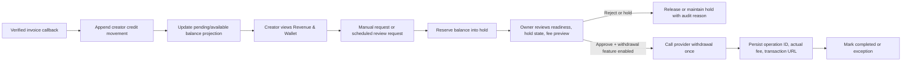

# Kryv Creator Earnings, Wallet, and Payout Control Plane

**Status:** implementation blueprint for a controlled crypto-first launch.  
**Author:** Manus AI  
**Scope:** creator earnings, creator payout preferences, owner review, provider reconciliation, and revenue visibility. This document deliberately excludes card rails, Stripe Connect, fiat checkout, and any end-user conversion or bank-transfer feature.

> **Product definition:** Kryv’s Creator Wallet is an internal, asset-denominated settlement ledger. It is **not** a bank account, a custodial USD account, or an investment product. USD figures are display-only reference values; settlement and payout remain in the recorded crypto asset.

## 1. Product outcome

Kryv will let a creator see what supporters paid, what fee policy applied, what is pending, what is available, and the status of a requested or scheduled payout. The system will support BTC, LTC, ETH, and DOGE only. Every amount is held in its original asset until an owner-approved payout sends it to the creator’s confirmed destination address. A viewer’s invoice return page, a creator’s browser, and an owner dashboard do not decide money state; only verified provider events and server-side ledger transactions do.

| Capability | Launch behavior | Authority |
| --- | --- | --- |
| Tips and subscriptions | A verified invoice callback creates the product effect and an immutable creator ledger movement. | Signed provider callback + database transaction |
| Creator balance | Shows pending, available, held, scheduled, and completed amounts by asset. | Derived from ledger and current balance projection |
| USD value | Uses a short-lived provider rate snapshot and is labeled “reference value—not a conversion quote.” | Server-side cached market reference |
| Payout address | Creator adds an address for one supported asset; Kryv stores encrypted ciphertext and returns only a masked form. | Server-side encrypted profile + confirmation state |
| Payout cadence | Creator may choose manual, daily, weekly, or monthly. Scheduled runs create reviewable payout requests; they do **not** silently move money. | Server-side preference and due-date evaluator |
| Payout execution | An owner reviews the request, fee preview, and hold status. A controlled provider withdrawal is a separate action behind a disabled feature flag. | Owner approval, feature flag, idempotent provider call |
| Owner finance view | Shows liability, provider treasury balance, payout queue, exceptions, and audit history without exposing full addresses or secrets. | Owner authorization + audit logs |

## 2. Reference patterns adopted—and deliberately not copied

Kick’s revenue screen is useful for its next-payout summary, category breakdown, period controls, trend view, and history. Its achievements screen provides a simple progress-path pattern, where eligibility is not automatic approval. Twitch’s Creator Dashboard demonstrates a durable creator sidebar, personalized next actions, and a separation of monetization from general settings. DGC Arcade demonstrates an owner financial overview, transaction monitoring, and a creator payout experience.

Kryv will adopt those **product patterns** in an original interface. It will not copy their branding, Stripe/card rails, gaming/promotion balance model, browser-stored wallet addresses, or client-supplied withdrawal amounts.

## 3. Creator information architecture

The existing Creator Studio sidebar will grow to the following product areas, with mobile navigation rendered as a horizontal task-aware control instead of a compressed desktop sidebar.

| Studio area | Creator-facing outcome |
| --- | --- |
| Live Control | Stream state, private credentials, preview, title, category, and live readiness. |
| Revenue & Wallet | Asset balances, USD reference values, settled support activity, transparent fees, payout profile, cadence, payout history, and request state. |
| Achievements | A clear payout-readiness path with server-computed progress and evidence. |
| Analytics | Viewer, stream, community, subscription, and support performance without mixing in financial authority. |
| Community & Moderation | Chat safety, moderation, engagement controls, and community management. |
| Content & Clips | Creator uploads, VOD, and clips. |
| Settings & Security | Channel profile, notification preferences, account security, and future step-up authentication. |

### Launch achievements: intentionally achievable, never cosmetic

The first path is **Creator Payout Ready**. It should be visible from day one and be achievable by a legitimate new creator without high audience thresholds.

| Milestone | Evidence computed on the server | Unlock effect |
| --- | --- | --- |
| Complete channel setup | Channel exists with display name and live category. | Creator Studio revenue setup becomes available. |
| Complete one qualifying broadcast | At least one conclusively ended live session with at least 15 minutes of duration. | Confirms that the creator has used the platform. |
| Save a confirmed payout destination | An encrypted address record exists for at least one supported asset and has completed the address-confirmation flow. | Enables payout request drafting for that asset. |
| Clear operational review | No active payout hold and an owner has approved the creator payout profile. | Enables submitted payout requests. |

These milestones do **not** exchange channel points for money, guarantee payment, promise verification, or override moderation/risk controls. A later security milestone can require two-factor authentication only after Kryv actually provides a complete two-factor system; it will not be falsely displayed as complete before then.

## 4. Ledger and balance design

The present `creator_balances` table is a projection for fast reads. It must not be the only financial record. A new immutable `creator_balance_movements` table will become the source of change history.

| Record | Purpose | Required controls |
| --- | --- | --- |
| `payment_intents` | Represents an initiated supporter invoice. | Unique internal order number and provider payment identity. |
| `payment_events` | Captures verified provider event identity and processing state. | Unique provider-event key and idempotent processing. |
| `creator_balance_movements` | Immutable credit/debit entries such as `tip_settled`, `subscription_settled`, `platform_fee`, `payout_reserved`, `payout_released`, `payout_completed`, and `payout_reversed`. | Unique source reference, currency precision of eight decimals, audit actor, and append-only semantics. |
| `creator_balances` | Current pending, available, and held projection by channel and asset. | Updated in the same database transaction as its movement. |
| `creator_payout_profiles` | One encrypted payout destination per creator/channel and supported asset. | AES-GCM ciphertext, key version, masked display value, address digest, confirmation state, last-changed time, and no plaintext response. |
| `creator_payout_preferences` | Manual/daily/weekly/monthly cadence and minimum payout threshold. | UTC schedule fields, update timestamp, and schedule state. |
| `payout_requests` | A point-in-time payout instruction snapshot. | Requested asset/amount, destination profile snapshot, fee/rate snapshot, source, status, risk-hold reason, provider operation identifier, transaction URL, and idempotency key. |
| `payout_approvals` | Every owner decision. | Reviewer, decision, reason, before/after state, and no self-approval policy. |

When a verified support callback completes, Kryv will calculate the creator credit according to the server-controlled fee policy. It will append a credit movement and update the `creator_balances` projection in one transaction. When a payout is requested, Kryv will lock the eligible available amount to `held_amount` and append a `payout_reserved` movement. Rejection releases that hold; provider completion appends `payout_completed`; provider failure appends `payout_released` or routes the balance to a documented exception state.

## 5. Fees, price references, and truthful revenue reporting

The creator revenue screen must show fee math rather than a vague “earnings” number. The initial owner-controlled policy should be set per `tip` and `subscription` product and expressed in basis points, with a disabled-by-default setting until the owner chooses the commercial terms.

| Amount category | Meaning | Treatment |
| --- | --- | --- |
| Gross received | The supported asset amount confirmed by the provider callback. | Immutable payment evidence. |
| Provider invoice fee | The invoice commission field, when provider-confirmed and applicable. | Recorded as provider fee evidence, never guessed. |
| Kryv platform fee | Configured by the owner under an audited versioned fee policy. | Separate movement; never hard-coded in the client. |
| Creator net credit | Gross amount less the configured applicable fees. | Credited in the received asset. |
| Payout network/provider fee | Fee preview before review and actual fee after execution. | Recorded separately; whether it is creator-paid or platform-paid is an explicit policy setting. |
| USD reference | Provider `price_usd` / rate snapshot at a recorded time. | Display-only; not a USD balance, conversion promise, or payout guarantee. |

Plisio documents currency metadata including a USD rate and price, balance lookup by asset, fee estimation for a withdrawal destination, and a withdrawal response that includes actual fee, provider operation ID, and blockchain transaction URL. These values support transparent *reference* values and payment evidence but do not make Kryv a USD wallet or a conversion service.[1] [2] [3] [4]

## 6. Payout lifecycle

Provider callbacks remain the authority for supporter payments. Plisio specifies invoice status updates by callback and an HMAC-style verification field; Kryv already verifies its JSON callback before persistence. Plisio’s documented withdrawal interface creates a single or mass cash-out with an operation ID, fee, and transaction URL, and requires the merchant request IP to be configured.[1] [3]

## 7. Cadence options and safe execution choices

Creator cadence is a preference, not permission to bypass controls. Each option is based on UTC and creates a payout request only when the creator has a confirmed address, meets the minimum asset threshold, has payout readiness, and has no active hold.

| Approach | Tradeoffs | Cost | Setup complexity |
| --- | --- | --- | --- |
| **Review-first release** | Creator chooses manual/daily/weekly/monthly; all due items become queued requests for owner review. Strongest controlled-launch behavior, but owner approves each release. | No separate scheduler required for manual requests. | Low; appropriate while transaction volume is zero. |
| **Scheduled review queue** | A dedicated recurring job generates due payout requests, while owner approval still controls provider withdrawal. Reduces missed paydays without making transfers autonomous. | Requires production-grade scheduled execution; Render cron jobs have a $1/month minimum, plus the selected production compute plan.[5] | Moderate; needs an idempotent job key, alerting, and deployment configuration. |
| **Risk-qualified auto-release** | A job can send eligible payouts without a human click, but it materially raises custody, operational, compliance, and incident-response requirements. | Production compute plus monitoring, controls, and provider operating balance. | High; defer until reconciliation, address confirmation, step-up security, and owner operating procedures have been proven. |

Render’s own documentation says its free web services spin down after 15 minutes idle and are not for production applications. Creator payout execution must therefore never depend on a free web process remaining awake. Render cron jobs offer a single-run guarantee and environment variables, but job setup is a production deployment decision; this task will not activate a scheduler or transfer funds.[5] [6]

## 8. Owner Finance Command

The Owner Console will receive a dedicated **Finance Command** area rather than mixing financial operations into Cinema publishing or general user administration.

| Owner workspace | Purpose |
| --- | --- |
| Overview | Provider asset balance, total creator available liability, pending/held liability, payout pipeline, USD reference timestamp, reconciliation variance, and callback health. |
| Creator Directory | Creator readiness, channel, asset balances, payout cadence, masked destination status, latest payout, holds, and owner review state. |
| Payout Queue | Request amount, asset, fee preview, request source, risk/eligibility evidence, reviewer decision, provider status, and transaction URL after completion. |
| Supporter Payments | Invoice, callback, entitlement, tip/subscription settlement state, fee evidence, and processing exceptions. |
| Fee Policy | Versioned platform fee settings, payout-fee policy, effective date, actor, and audit history. It starts disabled/unset. |
| Provider Reconciliation | Provider balances by asset, on-platform liabilities by asset, provider events, unmatched operations, and investigation notes. |
| Controls & Audit | `crypto_commerce`, `creator_payout_requests`, `scheduled_payout_requests`, and `provider_withdrawals` kill switches, plus immutable audit timeline. |

Full payout destinations, provider secret keys, raw callbacks, and private user data are never rendered in the owner UI. The owner may see masked addresses, evidence, status, and a controlled detail view only where necessary for a review.

## 9. Activation gates

| Gate | Required before it can be enabled |
| --- | --- |
| Crypto commerce | Production Plisio invoice configuration, callback URL, callback signature test, one owner-reviewed test invoice, and fee policy approval. |
| Creator payout requests | Encrypted payout-address key configured; creator ledger movements deployed; owner finance queue available; no current ledger reconciliation variance. |
| Scheduled payout requests | Production scheduler configured; UTC cadence test for daily/weekly/monthly; retry/idempotency test; alert recipient configured. |
| Provider withdrawals | Provider withdrawal request IP configured; provider asset balance verified; fee-estimation test; low-value owner-approved dry-run policy; reconciliation and incident playbook approved. |
| Auto-release | Separate explicit authorization after a sustained review-first pilot and compliance review. |

## References

[1]: https://plisio.net/documentation/endpoints/withdrawal-mass-withdrawal "Plisio — Withdrawal / Mass withdrawal"
[2]: https://plisio.net/documentation/endpoints/crypto-coins "Plisio — Crypto coins"
[3]: https://plisio.net/documentation/endpoints/create-an-invoice "Plisio — Create an invoice"
[4]: https://plisio.net/documentation/endpoints/fee-estimation "Plisio — Fee estimation"
[5]: https://render.com/docs/cronjobs "Render — Cron Jobs"
[6]: https://render.com/docs/free "Render — Deploy for Free"
